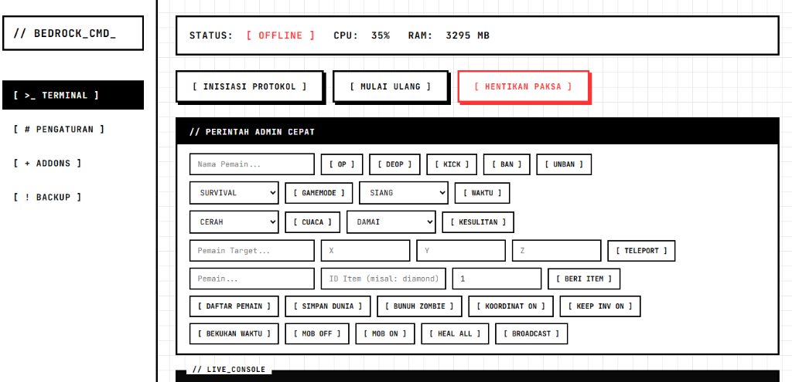

# 🎮 Bedrock Command Center

<div align="center">


**Panel kontrol modern untuk Minecraft Bedrock Dedicated Server**

*White Terminal Theme • Indonesian UI • Real-time Console*

</div>

---

## ✨ Fitur Utama

| Fitur | Deskripsi |
|-------|-----------|
| 🖥️ **Dashboard Real-time** | Monitor CPU, RAM, dan status server secara langsung |
| 📝 **Terminal Interaktif** | Kirim perintah langsung ke server console |
| ⚙️ **Pengaturan Lengkap** | Edit server.properties dengan UI yang mudah (26+ opsi) |
| 📦 **Manajer Addon** | Upload dan kelola .mcpack, .mcaddon, .mcworld, .mctemplate |
| 💾 **Sistem Backup** | Buat dan kelola backup dunia dengan satu klik |
| 🎮 **Perintah Admin Cepat** | Tombol shortcut untuk OP, KICK, BAN, gamemode, dll |
| 🌍 **Pilih Dunia Aktif** | Ganti world dengan mudah dari panel |
| 🔌 **Integrasi Playit.gg** | Simpan dan bagikan alamat Playit untuk multiplayer |

---

## 📸 Screenshot

<div align="center">

</div>

---

## 🚀 Instalasi

### Prasyarat
- [Node.js](https://nodejs.org/) versi 18 atau lebih baru
- [Minecraft Bedrock Dedicated Server](https://www.minecraft.net/en-us/download/server/bedrock)

### Langkah Instalasi

1. **Clone repository**
   ```bash
   git clone https://github.com/NoHeart6/panel_bedrock_cmd.git
   cd panel_bedrock_cmd
   ```

2. **Install dependencies**
   ```bash
   npm install
   ```

3. **Letakkan Bedrock Server**
   - Download Bedrock Dedicated Server dari link di atas
   - Extract ke folder `server/` di dalam project ini

4. **Jalankan Panel**
   ```bash
   # Menggunakan Node.js
   node index.js
   
   # Atau double-click
   start.bat
   ```

5. **Buka Browser**
   ```
   http://localhost:3000
   ```

---

## 📁 Struktur Folder

```
panel_bedrock_cmd/
├── index.js              # Server utama Express + Socket.io
├── start.bat             # Launcher Windows
├── package.json          # Dependencies
├── public/               # Frontend files
│   ├── index.html        # Halaman utama
│   ├── style.css         # Styling White Terminal
│   └── app.js            # Client-side logic
├── src/                  # Backend modules
│   ├── bedrock_wrapper.js    # Proses manager untuk bedrock_server.exe
│   └── server_manager.js     # Config, backup, addon manager
└── server/               # ⬅️ Letakkan Bedrock Server di sini
    ├── bedrock_server.exe
    ├── server.properties
    ├── worlds/
    ├── behavior_packs/
    └── resource_packs/
```

---

## 🎮 Cara Penggunaan

### Dashboard
- **MULAI/STOP/RESTART** - Kontrol server
- **Perintah Admin Cepat** - OP, BAN, KICK, gamemode, weather, dll
- **Terminal** - Kirim perintah custom

### Pengaturan
- **Playit.gg** - Simpan alamat tunnel untuk multiplayer
- **Pilih Dunia** - Ganti world aktif
- **26+ Opsi** - Semua setting server.properties

### Addons
- **Upload** - Drag & drop file .mcpack, .mcaddon, .mcworld, .mctemplate
- **SCAN ADDON** - Deteksi addon yang sudah terinstall
- **TERAPKAN** - Aktifkan addon/world ke server
- **Badge AKTIF** - Lihat addon mana yang sudah aktif

### Backups
- **Buat Backup** - Satu klik backup dunia
- **Download/Hapus** - Kelola file backup

---

## 🔧 API Endpoints

| Method | Endpoint | Deskripsi |
|--------|----------|-----------|
| GET | `/api/config` | Ambil server.properties |
| POST | `/api/config` | Update server.properties |
| GET | `/api/backups` | List semua backup |
| POST | `/api/backups` | Buat backup baru |
| GET | `/api/addons` | List addon terinstall |
| POST | `/api/addons/scan` | Scan addon existing |
| GET | `/api/addons/active` | Status addon aktif |
| POST | `/api/packs/apply` | Terapkan pack ke world |
| GET | `/api/worlds` | List dunia tersedia |
| GET | `/api/stats` | CPU & RAM usage |

---

## 🌐 Multiplayer dengan Playit.gg

Untuk bermain multiplayer tanpa port forwarding:

1. Download [Playit.gg](https://playit.gg/download)
2. Buat tunnel Minecraft Bedrock (port 19132)
3. Copy alamat tunnel (contoh: `abc123.craft.playit.gg`)
4. Paste di panel → Pengaturan → Alamat Playit
5. Bagikan alamat ke teman!

---

## 🛠️ Teknologi

- **Backend**: Node.js, Express, Socket.io
- **Frontend**: Vanilla HTML/CSS/JS
- **Font**: JetBrains Mono
- **Theme**: White Terminal / Clean Cyberpunk

---

## 📝 License

MIT License - Bebas digunakan dan dimodifikasi.

---

## 👤 Author

**NoHeart6**

- GitHub: [@NoHeart6](https://github.com/NoHeart6)

---

<div align="center">

Made with ❤️ for Minecraft Bedrock Community

</div>
